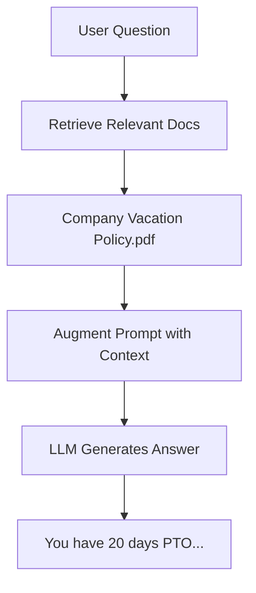

# 5.2 RAG (Retrieval Augmented Generation)

## 📋 Learning Objectives
By the end of this module, you will be able to:
- Understand the RAG architecture and its benefits
- Implement document loading and text splitting strategies
- Build a complete RAG pipeline from scratch
- Optimize retrieval quality with chunking strategies
- Create context-aware responses using retrieved documents

**Estimated Time:** Week 2-3 (8-10 hours)

---

## 📘 Theory Section (50%)

### What is RAG?

**RAG (Retrieval Augmented Generation)** solves a critical problem: LLMs don't know about your private data, recent events, or company-specific information.

#### The Problem Without RAG

```
User: "What's our company's vacation policy?"
LLM: "I don't have access to your company's specific policies."
```

#### The Solution With RAG



### The RAG Workflow

#### 1. **Index Phase** (One-time setup)
```python
# Load documents
docs = load_documents("company_policies/")

# Split into chunks
chunks = split_into_chunks(docs)

# Create embeddings and store
vectordb.add(chunks)
```

#### 2. **Retrieval Phase** (Every query)
```python
# User asks a question
question = "What's the vacation policy?"

# Find relevant chunks
relevant_chunks = vectordb.search(question, k=3)

# Build context
context = "\n".join(relevant_chunks)
```

#### 3. **Generation Phase**
```python
# Create prompt with context
prompt = f"""
Context: {context}

Question: {question}

Answer based on the context above.
"""

# Get answer from LLM
answer = llm(prompt)
```

### Why RAG is Powerful

| Without RAG | With RAG |
|-------------|----------|
| ❌ Generic answers | ✅ Specific to your data |
| ❌ Outdated information | ✅ Always up-to-date |
| ❌ No citations | ✅ Can cite sources |
| ❌ Hallucinations | ✅ Grounded in facts |

### Text Splitting Strategies

How you split documents dramatically affects quality.

#### Strategy 1: Fixed Size Chunks
```python
# Split every 500 characters
splitter = CharacterTextSplitter(chunk_size=500, chunk_overlap=50)
```
- **Pros**: Simple, predictable
- **Cons**: May break sentences/context

#### Strategy 2: Recursive Splitting
```python
# Split on paragraphs, then sentences, then words
splitter = RecursiveCharacterTextSplitter(
    chunk_size=1000,
    chunk_overlap=200,
    separators=["\n\n", "\n", ". ", " "]
)
```
- **Pros**: Preserves natural boundaries
- **Cons**: Variable chunk sizes

#### Strategy 3: Semantic Splitting (Advanced)
Split based on topic changes using embeddings.

### Chunk Size Trade-offs

```
Small Chunks (200-500 chars)
✅ Precise retrieval
✅ Less noise
❌ May lack context

Large Chunks (1000-2000 chars)
✅ More context
❌ Less precise
❌ May exceed LLM limits
```

**Best Practice**: Start with 1000 characters, 200 overlap.

---

## 🧪 Lab Section (50%)

### Lab 1: Document Loading

**Objective**: Load different document types

```python
# lab_document_loading.py
from langchain_community.document_loaders import (
    TextLoader,
    PyPDFLoader,
    DirectoryLoader
)

# Load a single text file
loader = TextLoader("data/sample.txt")
docs = loader.load()
print(f"Loaded {len(docs)} documents")
print(f"First 100 chars: {docs[0].page_content[:100]}")

# Load a PDF
pdf_loader = PyPDFLoader("data/manual.pdf")
pdf_docs = pdf_loader.load()
print(f"PDF has {len(pdf_docs)} pages")

# Load entire directory
dir_loader = DirectoryLoader("data/", glob="**/*.txt")
all_docs = dir_loader.load()
print(f"Total documents: {len(all_docs)}")
```

### Lab 2: Text Splitting Experiments

**Objective**: Compare different splitting strategies

```python
# lab_text_splitting.py
from langchain.text_splitter import (
    CharacterTextSplitter,
    RecursiveCharacterTextSplitter
)

sample_text = """
LangChain is a framework for developing applications powered by language models.

It enables applications that are context-aware and can reason about how to answer based on provided context.

The framework consists of several components including chains, agents, and memory.
"""

# Method 1: Character splitter
char_splitter = CharacterTextSplitter(
    separator="\n\n",
    chunk_size=100,
    chunk_overlap=20
)
char_chunks = char_splitter.split_text(sample_text)

# Method 2: Recursive splitter
recursive_splitter = RecursiveCharacterTextSplitter(
    chunk_size=100,
    chunk_overlap=20
)
recursive_chunks = recursive_splitter.split_text(sample_text)

print("Character Splitter:")
for i, chunk in enumerate(char_chunks):
    print(f"Chunk {i+1}: {chunk[:50]}...")

print("\nRecursive Splitter:")
for i, chunk in enumerate(recursive_chunks):
    print(f"Chunk {i+1}: {chunk[:50]}...")
```

### Lab 3: Building Your First RAG Pipeline

**Objective**: Complete end-to-end RAG system

```python
# lab_simple_rag.py
from langchain_community.document_loaders import TextLoader
from langchain.text_splitter import RecursiveCharacterTextSplitter
from langchain_community.vectorstores import Chroma
from langchain_openai import OpenAIEmbeddings, ChatOpenAI
from langchain.chains import RetrievalQA
from dotenv import load_dotenv

load_dotenv()

# Step 1: Load document
loader = TextLoader("knowledge_base.txt")
documents = loader.load()

# Step 2: Split into chunks
text_splitter = RecursiveCharacterTextSplitter(
    chunk_size=1000,
    chunk_overlap=200
)
chunks = text_splitter.split_documents(documents)
print(f"Split into {len(chunks)} chunks")

# Step 3: Create vector store
embeddings = OpenAIEmbeddings()
vectordb = Chroma.from_documents(
    documents=chunks,
    embedding=embeddings,
    persist_directory="./chroma_db"
)

# Step 4: Create retriever
retriever = vectordb.as_retriever(search_kwargs={"k": 3})

# Step 5: Create RAG chain
llm = ChatOpenAI(model="gpt-3.5-turbo", temperature=0)
qa_chain = RetrievalQA.from_chain_type(
    llm=llm,
    chain_type="stuff",
    retriever=retriever,
    return_source_documents=True
)

# Step 6: Ask questions
query = "What is LangChain used for?"
result = qa_chain({"query": query})

print(f"Question: {query}")
print(f"Answer: {result['result']}")
print(f"\nSources:")
for i, doc in enumerate(result['source_documents']):
    print(f"{i+1}. {doc.page_content[:100]}...")
```

### Lab 4: RAG with Custom Prompts

**Objective**: Control how the LLM uses context

```python
# lab_custom_rag_prompt.py
from langchain.prompts import PromptTemplate
from langchain.chains import RetrievalQA

# Custom prompt template
template = """You are a helpful AI assistant. Use the following context to answer the question.
If you don't know the answer based on the context, say "I don't have enough information."

Context: {context}

Question: {question}

Answer: Let me help you with that."""

PROMPT = PromptTemplate(
    template=template,
    input_variables=["context", "question"]
)

# Use custom prompt in chain
qa_chain = RetrievalQA.from_chain_type(
    llm=llm,
    chain_type="stuff",
    retriever=retriever,
    chain_type_kwargs={"prompt": PROMPT}
)
```

### 🎯 Hands-On Exercise: Company Knowledge Base

**Objective**: Build a RAG system for a fake company's documentation

**Scenario**: You work at "TechStart Inc." and need to build a Q&A system for employee handbook.

**Steps**:

1. **Create sample data** (`techstart_handbook.txt`):
```
TechStart Inc. Employee Handbook

Vacation Policy:
All full-time employees receive 20 days of paid time off per year.
Part-time employees receive prorated PTO based on hours worked...

Remote Work Policy:
Employees can work remotely up to 3 days per week.
Remote work must be approved by direct manager...

Health Benefits:
TechStart offers comprehensive health insurance through BlueCross.
Coverage begins on the first day of the month after hire date...
```

2. **Build the RAG pipeline**:
```python
# company_qa.py
# TODO: Implement the full pipeline
# - Load handbook
# - Split appropriately
# - Store in vector DB
# - Create QA chain
# - Test with questions
```

3. **Test Questions**:
   - "How many vacation days do I get?"
   - "What's the remote work policy?"
   - "When does health insurance start?"

**Success Criteria**:
- ✅ Answers are accurate and cite the handbook
- ✅ System says "I don't know" for questions not in handbook
- ✅ Retrieves relevant context

---

## 📊 Advanced Topics

### Retrieval Strategies

#### 1. **Maximum Marginal Relevance (MMR)**
Balances relevance with diversity.

```python
retriever = vectordb.as_retriever(
    search_type="mmr",
    search_kwargs={"k": 5, "fetch_k": 10}
)
```

#### 2. **Similarity Score Threshold**
Only retrieve if confidence is high.

```python
retriever = vectordb.as_retriever(
    search_type="similarity_score_threshold",
    search_kwargs={"score_threshold": 0.8}
)
```

### Chain Types

| Type | Description | Use Case |
|------|-------------|----------|
| **stuff** | Put all docs in one prompt | Small # of docs |
| **map_reduce** | Summarize each doc, then combine | Many docs |
| **refine** | Iteratively refine answer | Complex queries |
| **map_rerank** | Score each doc, use best | Need confidence scores |

---

## 📚 Resources & References

### Documentation
- [LangChain RAG Tutorial](https://python.langchain.com/docs/use_cases/question_answering/)
- [Text Splitters Guide](https://python.langchain.com/docs/modules/data_connection/document_transformers/)

### Research Papers
- "Retrieval-Augmented Generation for Knowledge-Intensive NLP Tasks" (Lewis et al., 2020)

### Tools
- [LangSmith](https://smith.langchain.com/) - Debug RAG pipelines
- [LlamaIndex](https://www.llamaindex.ai/) - Alternative RAG framework

---

## ✅ Knowledge Check

Before moving to the next module, ensure you can:
- [ ] Explain the three phases of RAG
- [ ] Choose appropriate chunk sizes for different use cases
- [ ] Build a complete RAG pipeline from scratch
- [ ] Debug retrieval quality issues
- [ ] Customize prompts for better answers

---

**Next Module**: [5.3 Integrating AI with existing APIs](../5.3_AI_API_Integration/content.md)
