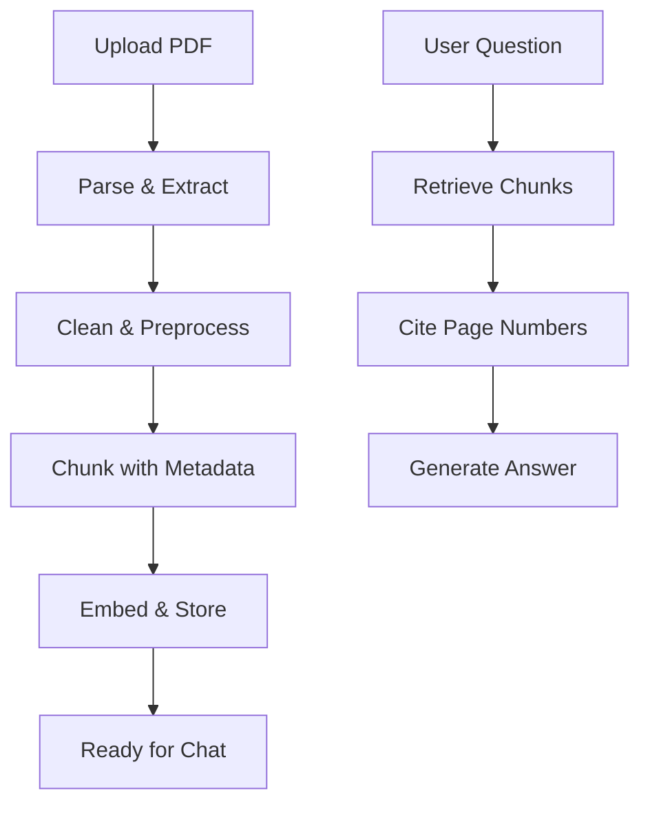

# 5.4 Examples: Chat with PDF

## 📋 Learning Objectives
By the end of this module, you will be able to:
- Parse and extract text from PDF documents
- Handle PDF-specific challenges (tables, images, multiple columns)
- Build a conversational interface for PDF Q&A
- Implement citation and source tracking
- Create a production-ready PDF chatbot

**Estimated Time:** Week 4-5 (10-12 hours)

---

## 📘 Theory Section (20%)

### Why PDF Chat is Special

PDFs present unique challenges:
- **Complex layouts**: Multi-column, headers, footers
- **Mixed content**: Text, images, tables, charts
- **Page boundaries**: Context may span pages
- **Poor structure**: Not semantically tagged

### PDF Parsing Approaches

| Approach | Library | Best For |
|----------|---------|----------|
| **PyPDF** | `pypdf` | Simple text PDFs |
| **PyMuPDF** | `pymupdf` (fitz) | Complex layouts, images |
| **PDFPlumber** | `pdfplumber` | Tables and structured data |
| **Unstructured** | `unstructured` | Mixed content, production |

### Architecture



---

## 🧪 Lab Section (80%)

### Lab 1: PDF Parsing Comparison

**Objective**: Compare different PDF parsing libraries

```python
# lab_pdf_parsing.py
from pypdf import PdfReader
import pdfplumber
import fitz  # PyMuPDF

pdf_path = "sample.pdf"

# Method 1: PyPDF
print("=== PyPDF ===")
reader = PdfReader(pdf_path)
for i, page in enumerate(reader.pages):
    text = page.extract_text()
    print(f"Page {i+1}: {text[:100]}...")

# Method 2: PDFPlumber (better for tables)
print("\n=== PDFPlumber ===")
with pdfplumber.open(pdf_path) as pdf:
    for i, page in enumerate(pdf.pages):
        text = page.extract_text()
        print(f"Page {i+1}: {text[:100]}...")
        
        # Extract tables
        tables = page.extract_tables()
        if tables:
            print(f"Found {len(tables)} tables on page {i+1}")

# Method 3: PyMuPDF (best for complex layouts)
print("\n=== PyMuPDF ===")
doc = fitz.open(pdf_path)
for i, page in enumerate(doc):
    text = page.get_text("text")
    print(f"Page {i+1}: {text[:100]}...")
```

### Lab 2: LangChain PDF Loading

**Objective**: Use LangChain's PDF loaders

```python
# lab_langchain_pdf.py
from langchain_community.document_loaders import (
    PyPDFLoader,
    PDFPlumberLoader,
    UnstructuredPDFLoader
)

pdf_path = "document.pdf"

# Loader 1: PyPDFLoader (default)
loader = PyPDFLoader(pdf_path)
pages = loader.load()

print(f"Loaded {len(pages)} pages")
print(f"Page 1 content: {pages[0].page_content[:200]}...")
print(f"Page 1 metadata: {pages[0].metadata}")

# Loader 2: With page numbers in metadata
for i, page in enumerate(pages):
    print(f"Page {page.metadata['page']}: {len(page.page_content)} chars")
```

### Lab 3: Building PDF Chat

**Objective**: Complete PDF chatbot with citations

```python
# pdf_chatbot.py
from langchain_community.document_loaders import PyPDFLoader
from langchain.text_splitter import RecursiveCharacterTextSplitter
from langchain_community.vectorstores import Chroma
from langchain_openai import OpenAIEmbeddings, ChatOpenAI
from langchain.chains import ConversationalRetrievalChain
from langchain.memory import ConversationBufferMemory
from dotenv import load_dotenv

load_dotenv()

class PDFChatbot:
    def __init__(self, pdf_path):
        """Initialize chatbot with a PDF."""
        print(f"📄 Loading {pdf_path}...")
        
        # Load PDF
        loader = PyPDFLoader(pdf_path)
        pages = loader.load()
        
        # Split with metadata preservation
        text_splitter = RecursiveCharacterTextSplitter(
            chunk_size=1000,
            chunk_overlap=200,
            separators=["\n\n", "\n", ". ", " "]
        )
        chunks = text_splitter.split_documents(pages)
        print(f"✂️  Split into {len(chunks)} chunks")
        
        # Create vector store
        embeddings = OpenAIEmbeddings()
        self.vectorstore = Chroma.from_documents(
            documents=chunks,
            embedding=embeddings
        )
        
        # Setup memory
        self.memory = ConversationBufferMemory(
            memory_key="chat_history",
            return_messages=True,
            output_key="answer"
        )
        
        # Create chain
        self.llm = ChatOpenAI(model="gpt-3.5-turbo", temperature=0)
        self.chain = ConversationalRetrievalChain.from_llm(
            llm=self.llm,
            retriever=self.vectorstore.as_retriever(search_kwargs={"k": 3}),
            memory=self.memory,
            return_source_documents=True
        )
        
        print("✅ Ready to chat!\n")
    
    def ask(self, question):
        """Ask a question about the PDF."""
        result = self.chain({"question": question})
        
        answer = result["answer"]
        sources = result["source_documents"]
        
        print(f"🤖 Answer: {answer}\n")
        
        # Show sources with page numbers
        print("📚 Sources:")
        seen_pages = set()
        for doc in sources:
            page_num = doc.metadata.get("page", "Unknown")
            if page_num not in seen_pages:
                preview = doc.page_content[:150].replace("\n", " ")
                print(f"   Page {page_num + 1}: {preview}...")
                seen_pages.add(page_num)
        print()
    
    def chat(self):
        """Interactive chat loop."""
        print("Type 'quit' to exit\n")
        while True:
            question = input("You: ")
            if question.lower() in ['quit', 'exit']:
                break
            self.ask(question)

# Usage
if __name__ == "__main__":
    chatbot = PDFChatbot("example.pdf")
    chatbot.chat()
```

### 🎯 Mini Project 3: Enhanced PDF Chatbot

**Objective**: Build a production-ready PDF chat interface with Streamlit

**Features**:
1. ✅ Upload multiple PDFs
2. ✅ Show extraction progress
3. ✅ Display chat history
4. ✅ Highlight citations
5. ✅ Export conversation

**Starter Code**:

```python
# app.py
import streamlit as st
from langchain_community.document_loaders import PyPDFLoader
from langchain.text_splitter import RecursiveCharacterTextSplitter
from langchain_community.vectorstores import Chroma
from langchain_openai import OpenAIEmbeddings, ChatOpenAI
from langchain.chains import ConversationalRetrievalChain
from langchain.memory import ConversationBufferMemory
import tempfile
import os

st.set_page_config(page_title="PDF Chat", page_icon="📄")

st.title("📄 Chat with Your PDFs")

# Sidebar for PDF upload
with st.sidebar:
    st.header("Upload PDFs")
    uploaded_files = st.file_uploader(
        "Choose PDF files",
        type="pdf",
        accept_multiple_files=True
    )
    
    process_button = st.button("Process PDFs")

# Initialize session state
if "messages" not in st.session_state:
    st.session_state.messages = []
if "chain" not in st.session_state:
    st.session_state.chain = None

# Process PDFs
if process_button and uploaded_files:
    with st.spinner("Processing PDFs..."):
        all_documents = []
        
        # Load each PDF
        for uploaded_file in uploaded_files:
            # Save to temp file
            with tempfile.NamedTemporaryFile(delete=False, suffix=".pdf") as tmp:
                tmp.write(uploaded_file.getvalue())
                tmp_path = tmp.name
            
            # Load PDF
            loader = PyPDFLoader(tmp_path)
            docs = loader.load()
            all_documents.extend(docs)
            
            os.unlink(tmp_path)
        
        # Split documents
        text_splitter = RecursiveCharacterTextSplitter(
            chunk_size=1000,
            chunk_overlap=200
        )
        chunks = text_splitter.split_documents(all_documents)
        
        # Create vector store
        embeddings = OpenAIEmbeddings()
        vectorstore = Chroma.from_documents(chunks, embeddings)
        
        # Create chain
        memory = ConversationBufferMemory(
            memory_key="chat_history",
            return_messages=True,
            output_key="answer"
        )
        
        llm = ChatOpenAI(model="gpt-3.5-turbo", temperature=0)
        chain = ConversationalRetrievalChain.from_llm(
            llm=llm,
            retriever=vectorstore.as_retriever(search_kwargs={"k": 3}),
            memory=memory,
            return_source_documents=True
        )
        
        st.session_state.chain = chain
        st.success(f"✅ Processed {len(uploaded_files)} PDFs ({len(chunks)} chunks)")

# Chat interface
if st.session_state.chain:
    # Display chat history
    for message in st.session_state.messages:
        with st.chat_message(message["role"]):
            st.write(message["content"])
            if "sources" in message:
                with st.expander("📚 Sources"):
                    for source in message["sources"]:
                        st.caption(f"Page {source}")
    
    # Chat input
    if prompt := st.chat_input("Ask a question about your PDFs"):
        # Add user message
        st.session_state.messages.append({"role": "user", "content": prompt})
        with st.chat_message("user"):
            st.write(prompt)
        
        # Get response
        with st.chat_message("assistant"):
            with st.spinner("Thinking..."):
                result = st.session_state.chain({"question": prompt})
                answer = result["answer"]
                sources = result["source_documents"]
                
                st.write(answer)
                
                # Show sources
                page_nums = [doc.metadata.get("page", "?") + 1 for doc in sources]
                with st.expander("📚 Sources"):
                    for i, doc in enumerate(sources):
                        st.caption(f"**Page {page_nums[i]}**: {doc.page_content[:200]}...")
                
                # Save to history
                st.session_state.messages.append({
                    "role": "assistant",
                    "content": answer,
                    "sources": page_nums
                })
else:
    st.info("👈 Upload PDFs in the sidebar to get started")

# Run with: streamlit run app.py
```

### Lab 4: Advanced PDF Features

**Objective**: Handle tables and images

```python
# advanced_pdf.py
import pdfplumber
from langchain.schema import Document

def extract_pdf_with_tables(pdf_path):
    """Extract text and tables separately."""
    documents = []
    
    with pdfplumber.open(pdf_path) as pdf:
        for page_num, page in enumerate(pdf.pages):
            # Extract text
            text = page.extract_text() or ""
            
            # Extract tables
            tables = page.extract_tables()
            
            # Create document for text
            if text.strip():
                doc = Document(
                    page_content=text,
                    metadata={
                        "page": page_num,
                        "type": "text"
                    }
                )
                documents.append(doc)
            
            # Create documents for tables
            for i, table in enumerate(tables):
                # Convert table to markdown
                table_md = table_to_markdown(table)
                doc = Document(
                    page_content=table_md,
                    metadata={
                        "page": page_num,
                        "type": "table",
                        "table_index": i
                    }
                )
                documents.append(doc)
    
    return documents

def table_to_markdown(table):
    """Convert table to markdown format."""
    if not table:
        return ""
    
    # Header
    md = "| " + " | ".join(str(cell or "") for cell in table[0]) + " |\n"
    md += "|" + "|".join(["---"] * len(table[0])) + "|\n"
    
    # Rows
    for row in table[1:]:
        md += "| " + " | ".join(str(cell or "") for cell in row) + " |\n"
    
    return md
```

---

## 🎨 UI/UX Best Practices

### Progress Indicators
```python
import streamlit as st

progress_bar = st.progress(0)
for i, file in enumerate(files):
    # Process file
    progress_bar.progress((i + 1) / len(files))
```

### Error Handling
```python
try:
    result = chain(question)
except Exception as e:
    st.error(f"Error: {str(e)}")
    st.info("Try rephrasing your question or uploading a different PDF.")
```

### Response Formatting
```python
# Highlight citations
answer_with_citations = answer.replace(
    "[1]",
    "[[1]](javascript:showSource(1))"
)
```

---

## 📚 Resources & References

### Documentation
- [LangChain PDF Loaders](https://python.langchain.com/docs/modules/data_connection/document_loaders/pdf)
- [Streamlit Documentation](https://docs.streamlit.io/)
- [PDFPlumber Guide](https://github.com/jsvine/pdfplumber)

### Sample PDFs for Testing
- [arXiv Papers](https://arxiv.org/) - Research papers
- [Government Reports](https://www.usa.gov/reports) - Public documents

---

## ✅ Knowledge Check

Before moving to the next module, ensure you can:
- [ ] Extract text from PDFs using multiple methods
- [ ] Preserve page numbers in metadata
- [ ] Build a conversational PDF chatbot
- [ ] Create a Streamlit interface
- [ ] Handle tables and complex layouts
- [ ] Complete Mini Project 3

---

**Next Module**: [5.5 Project: Support Bot with Memory](../5.5_Support_Bot_Project/content.md)
