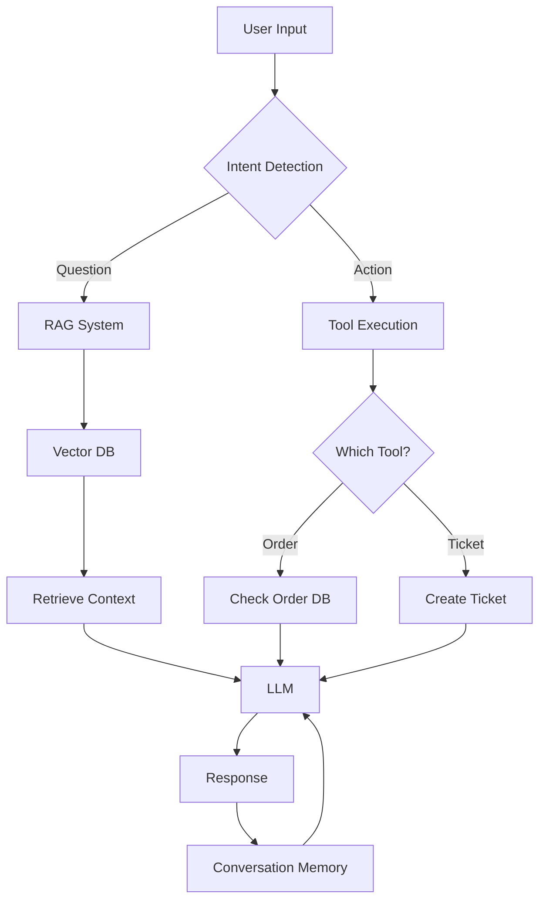

# 5.5 Major Project: Support Bot with Memory

## 📋 Project Overview
Build a comprehensive Customer Support Bot for "TechNova" - a fictional tech company. This project integrates everything you've learned: RAG, function calling, memory, and conversational interfaces.

**Estimated Time:** Week 6-8 (20-25 hours)

---

## 🎯 Project Requirements

### Mandatory Features
1. ✅ **Knowledge Base**: RAG system using TechNova product manual
2. ✅ **Memory**: Remembers user name and conversation context
3. ✅ **Tools**: Check order status, create support tickets
4. ✅ **Multi-turn Conversations**: Natural dialogue flow
5. ✅ **Web Interface**: User-friendly Streamlit app

### Bonus Features (Optional)
- 🌟 User authentication
- 🌟 Email notifications
- 🌟 Analytics dashboard
- 🌟 Multi-language support

---

## 📐 Architecture



---

## 🗂️ Project Structure

```
support_bot/
├── app.py                  # Streamlit interface
├── bot.py                 # Core bot logic
├── tools.py               # Tool definitions
├── data/
│   ├── product_manual.pdf # Knowledge base
│   └── orders.json        # Mock order database
├── requirements.txt
├── .env                   # API keys
└── README.md
```

---

## 🛠️ Implementation Guide

### Step 1: Setup Project

```bash
mkdir support_bot
cd support_bot

# Create virtual environment
python -m venv venv
source venv/bin/activate

# Install dependencies
pip install \
    langchain \
    langchain-openai \
    langchain-community \
    chromadb \
    streamlit \
    python-dotenv \
    pypdf
```

**requirements.txt**:
```
langchain==0.1.0
langchain-openai==0.0.5
langchain-community==0.0.13
chromadb==0.4.22
streamlit==1.30.0
python-dotenv==1.0.0
pypdf==3.17.4
```

### Step 2: Create Product Manual

**data/product_manual.txt** (sample):
```
TechNova Product Manual

Section 1: Getting Started
Welcome to TechNova! Our flagship product, the SmartHub Pro, is an all-in-one home automation system...

Section 2: Installation
1. Unbox your SmartHub Pro carefully
2. Connect the power adapter
3. Download the TechNova app...

Section 3: Troubleshooting
Q: SmartHub won't connect to WiFi
A: Ensure you're using 2.4GHz network, not 5GHz...

Section 4: Warranty
All TechNova products come with a 2-year warranty...
```

### Step 3: Create Mock Order Database

**data/orders.json**:
```json
{
  "orders": [
    {
      "order_id": "TN-2024-001",
      "customer_name": "John Doe",
      "product": "SmartHub Pro",
      "status": "Shipped",
      "tracking": "USPS1234567890",
      "delivery_date": "2024-12-20"
    },
    {
      "order_id": "TN-2024-002",
      "customer_name": "Jane Smith",
      "product": "SmartHub Lite",
      "status": "Processing",
      "tracking": null,
      "delivery_date": null
    }
  ],
  "tickets": []
}
```

### Step 4: Implement Tools

**tools.py**:
```python
import json
from datetime import datetime
from typing import Optional

def load_orders():
    """Load orders from JSON file."""
    with open("data/orders.json", "r") as f:
        return json.load(f)

def save_orders(data):
    """Save orders to JSON file."""
    with open("data/orders.json", "w") as f:
        json.dump(data, f, indent=2)

def check_order_status(order_id: str) -> dict:
    """
    Check the status of an order.
    
    Args:
        order_id: The order ID to check (e.g., TN-2024-001)
    
    Returns:
        Dictionary with order details or error message
    """
    data = load_orders()
    
    for order in data["orders"]:
        if order["order_id"].lower() == order_id.lower():
            return {
                "success": True,
                "order_id": order["order_id"],
                "product": order["product"],
                "status": order["status"],
                "tracking": order["tracking"],
                "delivery_date": order["delivery_date"]
            }
    
    return {
        "success": False,
        "error": f"Order {order_id} not found"
    }

def create_support_ticket(
    customer_name: str,
    issue_type: str,
    description: str,
    order_id: Optional[str] = None
) -> dict:
    """
    Create a new support ticket.
    
    Args:
        customer_name: Name of the customer
        issue_type: Type of issue (technical, shipping, return, other)
        description: Detailed description of the issue
        order_id: Optional order ID related to the ticket
    
    Returns:
        Dictionary with ticket details
    """
    data = load_orders()
    
    # Generate ticket ID
    ticket_count = len(data["tickets"])
    ticket_id = f"TICKET-{ticket_count + 1:04d}"
    
    # Create ticket
    ticket = {
        "ticket_id": ticket_id,
        "customer_name": customer_name,
        "issue_type": issue_type,
        "description": description,
        "order_id": order_id,
        "status": "Open",
        "created_at": datetime.now().isoformat()
    }
    
    data["tickets"].append(ticket)
    save_orders(data)
    
    return {
        "success": True,
        "ticket_id": ticket_id,
        "message": f"Ticket {ticket_id} created successfully"
    }

# Tool definitions for LangChain
TOOL_DEFINITIONS = [
    {
        "type": "function",
        "function": {
            "name": "check_order_status",
            "description": "Check the status of a customer order by order ID",
            "parameters": {
                "type": "object",
                "properties": {
                    "order_id": {
                        "type": "string",
                        "description": "The order ID (e.g., TN-2024-001)"
                    }
                },
                "required": ["order_id"]
            }
        }
    },
    {
        "type": "function",
        "function": {
            "name": "create_support_ticket",
            "description": "Create a new support ticket for a customer issue",
            "parameters": {
                "type": "object",
                "properties": {
                    "customer_name": {
                        "type": "string",
                        "description": "Name of the customer"
                    },
                    "issue_type": {
                        "type": "string",
                        "enum": ["technical", "shipping", "return", "other"],
                        "description": "Type of issue"
                    },
                    "description": {
                        "type": "string",
                        "description": "Detailed description of the issue"
                    },
                    "order_id": {
                        "type": "string",
                        "description": "Optional order ID if issue is related to an order"
                    }
                },
                "required": ["customer_name", "issue_type", "description"]
            }
        }
    }
]

TOOL_FUNCTIONS = {
    "check_order_status": check_order_status,
    "create_support_ticket": create_support_ticket
}
```

### Step 5: Build the Bot

**bot.py**:
```python
import os
from langchain_community.document_loaders import TextLoader
from langchain.text_splitter import RecursiveCharacterTextSplitter
from langchain_community.vectorstores import Chroma
from langchain_openai import OpenAIEmbeddings, ChatOpenAI
from langchain.chains import ConversationalRetrievalChain
from langchain.memory import ConversationBufferMemory
from langchain.agents import initialize_agent, AgentType
from langchain.tools import Tool
from dotenv import load_dotenv
from tools import TOOL_FUNCTIONS, TOOL_DEFINITIONS

load_dotenv()

class TechNovaSupportBot:
    def __init__(self):
        """Initialize the support bot."""
        # Load and index product manual
        self._setup_knowledge_base()
        
        # Setup memory
        self.memory = ConversationBufferMemory(
            memory_key="chat_history",
            return_messages=True
        )
        
        # Setup LLM
        self.llm = ChatOpenAI(model="gpt-4", temperature=0)
        
        # Setup tools
        self.tools = [
            Tool(
                name="check_order_status",
                func=TOOL_FUNCTIONS["check_order_status"],
                description="Check order status by order ID"
            ),
            Tool(
                name="create_support_ticket",
                func=TOOL_FUNCTIONS["create_support_ticket"],
                description="Create a support ticket"
            ),
            Tool(
                name="search_knowledge_base",
                func=self._search_kb,
                description="Search product manual for information"
            )
        ]
        
        # Create agent
        self.agent = initialize_agent(
            tools=self.tools,
            llm=self.llm,
            agent=AgentType.CONVERSATIONAL_REACT_DESCRIPTION,
            memory=self.memory,
            verbose=True
        )
    
    def _setup_knowledge_base(self):
        """Load and index the product manual."""
        loader = TextLoader("data/product_manual.txt")
        docs = loader.load()
        
        splitter = RecursiveCharacterTextSplitter(
            chunk_size=500,
            chunk_overlap=50
        )
        chunks = splitter.split_documents(docs)
        
        embeddings = OpenAIEmbeddings()
        self.vectorstore = Chroma.from_documents(
            chunks,
            embeddings,
            persist_directory="./chroma_db"
        )
        
        self.retriever = self.vectorstore.as_retriever(search_kwargs={"k": 2})
    
    def _search_kb(self, query: str) -> str:
        """Search knowledge base."""
        docs = self.retriever.get_relevant_documents(query)
        return "\n".join([doc.page_content for doc in docs])
    
    def chat(self, message: str) -> str:
        """Process a user message."""
        response = self.agent.run(message)
        return response
```

### Step 6: Create Streamlit Interface

**app.py**:
```python
import streamlit as st
from bot import TechNovaSupportBot

st.set_page_config(
    page_title="TechNova Support",
    page_icon="🤖",
    layout="wide"
)

# Custom CSS
st.markdown("""
<style>
.main-header {
    font-size: 2.5rem;
    color: #1f77b4;
    text-align: center;
    margin-bottom: 2rem;
}
.chat-message {
    padding: 1rem;
    border-radius: 0.5rem;
    margin-bottom: 1rem;
}
.user-message {
    background-color: #e3f2fd;
}
.assistant-message {
    background-color: #f5f5f5;
}
</style>
""", unsafe_allow_html=True)

st.markdown('<h1 class="main-header">🤖 TechNova Support Bot</h1>', unsafe_allow_html=True)

# Initialize bot
if "bot" not in st.session_state:
    with st.spinner("Initializing bot..."):
        st.session_state.bot = TechNovaSupportBot()
    st.success("Bot ready!")

# Initialize chat history
if "messages" not in st.session_state:
    st.session_state.messages = []
    # Welcome message
    st.session_state.messages.append({
        "role": "assistant",
        "content": "Hello! I'm the TechNova support assistant. I can help you with product information, order status, and creating support tickets. What's your name?"
    })

# Display chat history
for message in st.session_state.messages:
    css_class = "user-message" if message["role"] == "user" else "assistant-message"
    with st.container():
        st.markdown(f'<div class="chat-message {css_class}">', unsafe_allow_html=True)
        st.markdown(f"**{message['role'].title()}**: {message['content']}")
        st.markdown('</div>', unsafe_allow_html=True)

# Chat input
if prompt := st.chat_input("Type your message..."):
    # Add user message
    st.session_state.messages.append({"role": "user", "content": prompt})
    
    # Get bot response
    with st.spinner("Thinking..."):
        response = st.session_state.bot.chat(prompt)
    
    # Add assistant message
    st.session_state.messages.append({"role": "assistant", "content": response})
    
    # Rerun to update chat
    st.rerun()

# Sidebar
with st.sidebar:
    st.header("ℹ️ About")
    st.write("This is a demo support bot for TechNova.")
    
    if st.button("Clear Chat"):
        st.session_state.messages = []
        st.session_state.bot = TechNovaSupportBot()
        st.rerun()
```

---

## 🧪 Testing Scenarios

Test your bot with these conversations:

### Scenario 1: Product Information
```
User: Hi, I'm Alex
Bot: Hello Alex! How can I help you today?
User: How do I connect my SmartHub to WiFi?
Bot: [Should retrieve from manual and provide steps]
```

### Scenario 2: Order Status
```
User: Can you check my order TN-2024-001?
Bot: [Should call check_order_status tool]
```

### Scenario 3: Create Ticket
```
User: My SmartHub won't turn on
Bot: I can create a support ticket for you. Can you provide more details?
User: I've tried everything, it's completely dead
Bot: [Should create ticket and provide ticket ID]
```

---

## 📊 Evaluation Criteria

| Feature | Points |
|---------|--------|
| RAG works correctly | 20 |
| Tools execute properly | 20 |
| Memory persists | 15 |
| Natural conversation flow | 15 |
| UI is user-friendly | 15 |
| Error handling | 10 |
| Code quality | 5 |

**Total: 100 points**

---

## 🚀 Deployment (Bonus)

Deploy to Streamlit Cloud:
```bash
# Push to GitHub
git init
git add .
git commit -m "TechNova Support Bot"
git push origin main

# Deploy on streamlit.io
# Add OPENAI_API_KEY to secrets
```

---

## ✅ Submission Checklist

- [ ] Bot can answer questions from manual
- [ ] Bot can check order status
- [ ] Bot can create support tickets
- [ ] Bot remembers user name
- [ ] Streamlit interface works
- [ ] Code is documented
- [ ] README with setup instructions
- [ ] Demo video (optional)

---

**Next Module**: [5.6 Quiz: RAG & Integration](../5.6_Quiz/content.md)
